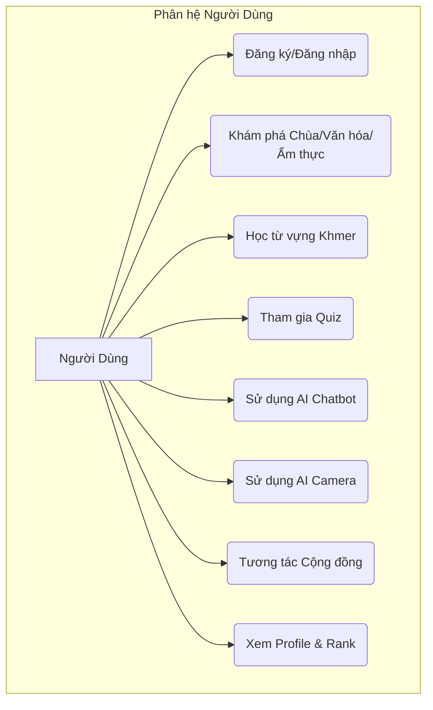
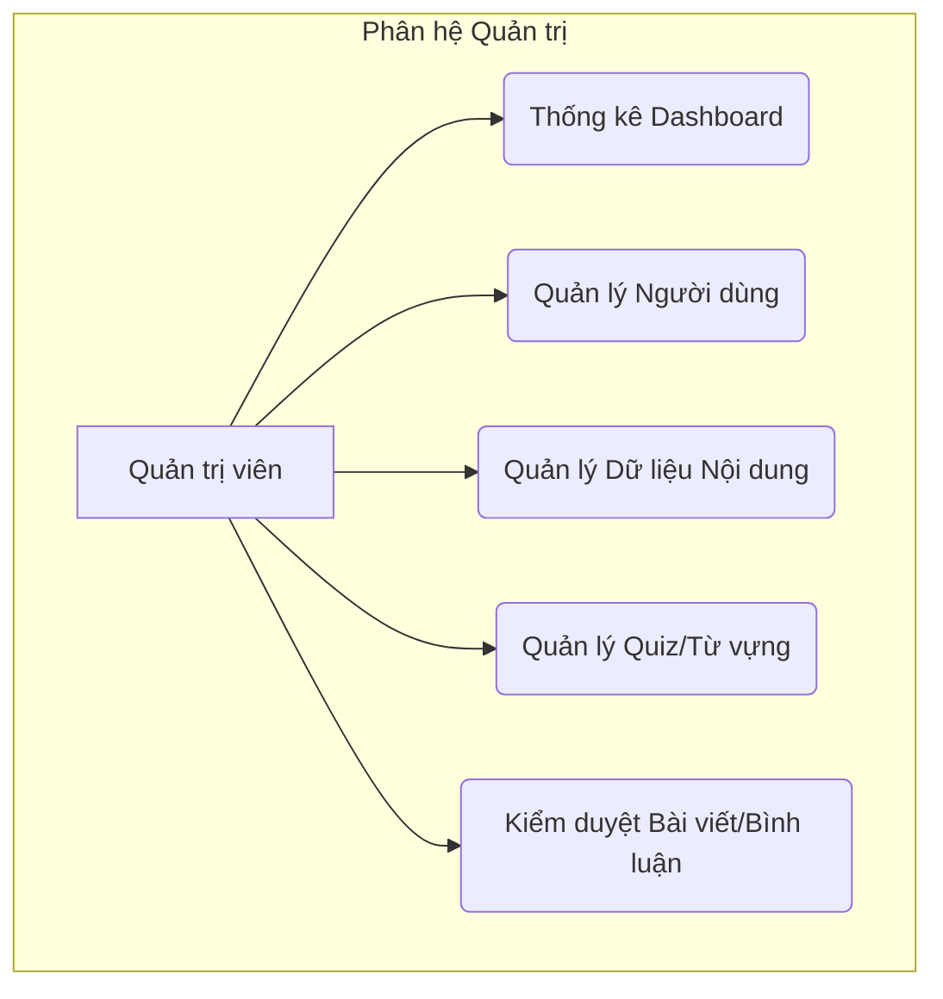
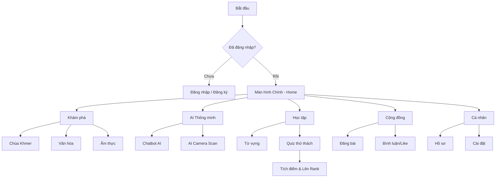
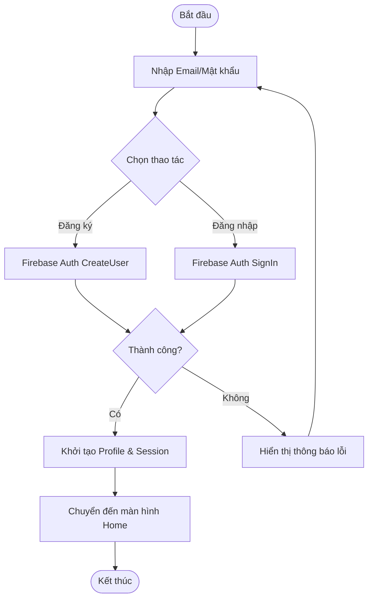
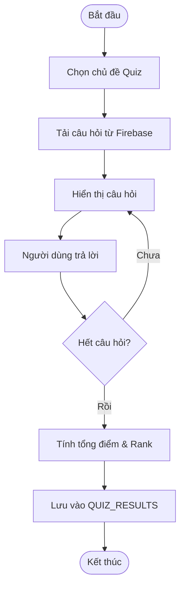
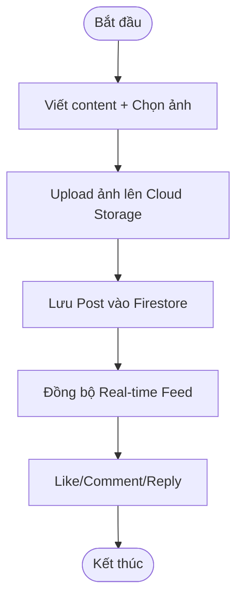
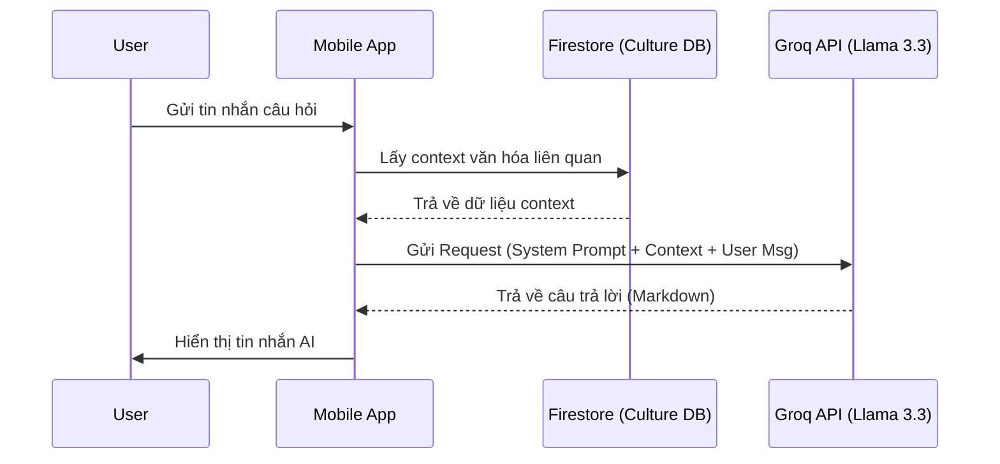
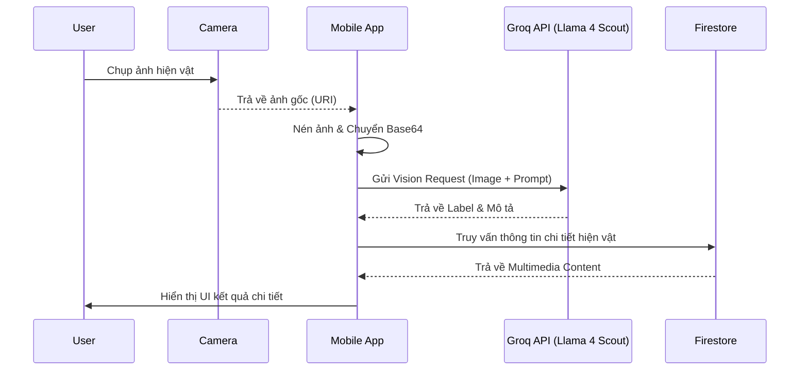
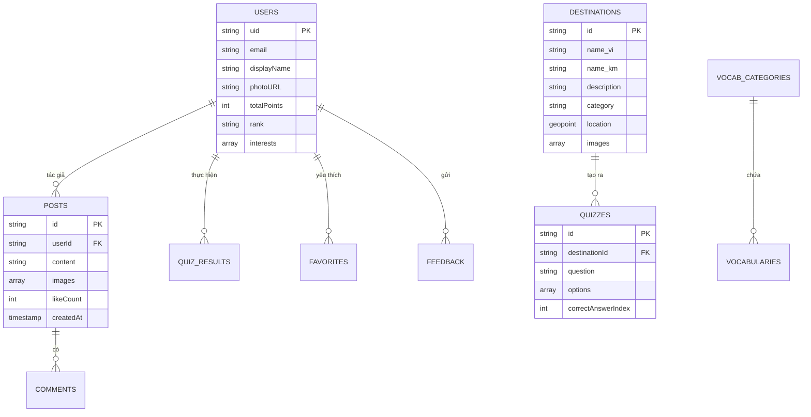

# CHƯƠNG 3: PHÂN TÍCH VÀ THIẾT KẾ HỆ THỐNG

## 3.1. Khảo sát hiện trạng và đề xuất giải pháp

### 3.1.1. Thực trạng tiếp cận văn hóa Khmer hiện nay 
Trong kỷ nguyên chuyển đổi số, nhu cầu tìm hiểu và tiếp cận các giá trị di sản văn hóa thông qua nền tảng công nghệ đang trở thành xu hướng tất yếu. Đối với cộng đồng Khmer Nam Bộ, kho tàng di sản từ chùa chiền, lễ hội đến nghệ thuật dân gian vô cùng đồ sộ nhưng hiện đang đối mặt với sự đứt gãy về tư liệu số. Phần lớn tri thức vẫn được lưu giữ dưới dạng sách giấy truyền thống tại các chùa hoặc lưu truyền miệng trong cộng đồng nghệ nhân lớn tuổi.

Mặc dù Internet đã cung cấp một lượng thông tin nhất định, nhưng dữ liệu thường mang tính phân tán, thiếu sự thẩm định và chủ yếu là các hình ảnh tĩnh, không tạo được môi trường tương tác sinh động. Điều này tạo ra một khoảng cách lớn đối với thế hệ trẻ - nhóm đối tượng ưu tiên sử dụng thiết bị di động để tiếp nhận thông tin. Do đó, việc xây dựng một hệ sinh thái số tập trung, ứng dụng trí tuệ nhân tạo để "sống dậy" các giá trị văn hóa là một bài toán cấp thiết.

### 3.1.2. Đánh giá hệ thống hiện có 
Hệ thống nghiên cứu đã tiến hành phân tích đối sánh (Benchmarking) với các nền tảng hàng đầu:
- **Duolingo**: Rất mạnh về cơ chế trò chơi hóa (Gamification) trong dạy ngôn ngữ nhưng thiếu đi bối cảnh văn hóa đặc thù của vùng miền.
- **Google Arts & Culture**: Cung cấp kho dữ liệu hình ảnh chất lượng cao và bảo tàng ảo, nhưng chưa hỗ trợ tương tác trực tiếp qua Chatbot chuyên biệt hay nhận diện hiện vật đặc thù của người Khmer tại Nam Bộ.
- **ChatGPT/Gemini**: Có khả năng vấn đáp tốt nhưng dữ liệu về văn hóa dân tộc địa phương thường mang tính tổng quát, đôi khi thiếu chính xác về các chi tiết tín ngưỡng đặc thù.

### 3.1.3. Giải pháp đề xuất KhmerGo 
KhmerGo ra đời với mục tiêu trở thành một trợ lý văn hóa kỹ thuật số toàn diện. Hệ thống không chỉ dừng lại ở việc lưu trữ mà còn tập trung vào trải nghiệm "Explore - Learn - Share" (Khám phá - Học tập - Chia sẻ). Bằng cách kết hợp giữa React Native, Firebase và các mô hình AI tiên tiến, KhmerGo mang lại một nền tảng đa năng: từ học tiếng Khmer cơ bản đến việc sử dụng AI Camera để nhận diện và hiểu ý nghĩa của từng họa tiết trên mái chùa hay các hiện vật trưng bày trong bảo tàng.

---

## 3.2. Phân tích yêu cầu hệ thống

### 3.2.1. Yêu cầu chức năng
Hệ thống được thiết kế với hai phân hệ tương tác chặt chẽ thông qua nền tảng Firebase:

**A. Phân hệ người dùng (User):**
- **Quản lý tài khoản**: Hỗ trợ đăng nhập qua Email/Mật khẩu hoặc tài khoản Google. Người dùng có thể quản lý hồ sơ, cập nhật sở thích cá nhân và theo dõi quá trình thăng hạng (Rank).
- **Khám phá di sản**: Cung cấp dữ liệu chi tiết về 4 nhóm nội dung chính: Chùa Khmer (Pagoda), Văn hóa truyền thống (Culture), Ẩm thực (Food) và Ngôn ngữ (Language). Tích hợp bản đồ vị trí, hình ảnh chất lượng cao và các bài viết thuyết minh chuyên sâu.
- **Trí tuệ nhân tạo (AI)**:
    - **AI Chatbot**: Trợ lý ảo sử dụng mô hình Llama 3.3 hỗ trợ tra cứu văn hóa bằng ngôn ngữ tự nhiên.
    - **AI Camera**: Nhận diện hiện vật và kiến trúc bằng thị giác máy tính (Llama 4 Scout).
- **Giáo dục và Trải nghiệm**: Học từ vựng Khmer qua hệ thống Flashcards phân loại theo chủ đề. Tham gia các bài thử thách kiến thức (Quiz) đa dạng. Hệ thống điểm thưởng và bảng xếp hạng (Leaderboard) theo các cấp bậc: Đồng, Bạc, Vàng, Bạch Kim, Kim Cương và Huyền Thoại.
- **Cộng đồng**: Mạng xã hội thu nhỏ cho phép đăng bài viết (kèm hình ảnh), bày tỏ cảm xúc (Like), bình luận và phản hồi (Reply).

**B. Phân hệ quản trị (Admin):**
- **Dashboard trực quan**: Thống kê tổng số người dùng, lượt tương tác và bảng xếp hạng theo thời gian thực.
- **Quản lý dữ liệu số**: Bộ công cụ (Thêm, Sửa, Xóa) cho danh mục nội dung, từ vựng và ngân hàng câu hỏi Quiz.
- **Quản lý cộng đồng**: Kiểm duyệt bài viết, quản lý phản hồi người dùng và xử lý các nội dung vi phạm tiêu chuẩn cộng đồng.

### 3.2.2. Yêu cầu phi chức năng
- **Hiệu năng**: Tải dữ liệu bất đồng bộ (Lazy loading) giúp ứng dụng hoạt động mượt mà. Thời gian phản hồi AI trung bình dưới 5 giây nhờ hạ tầng Groq API.
- **Bảo mật**: Sử dụng Firebase Security Rules để phân quyền dữ liệu.
- **Khả năng linh hoạt**: Sử dụng kiến trúc Mobile App với React Native giúp triển khai dễ dàng trên cả Android và iOS.
- **Tính khả dụng**: Hệ thống đa ngôn ngữ (Việt - Khmer) chuyển đổi tức thì. Giao diện Responsive cho nhiều kích thước màn hình.
- **Thông báo**: Cơ chế Push Notification khi có tương tác mới hoặc đạt thành tích.

---

## 3.3. Phân tích tác nhân và ca sử dụng

Hệ thống xác định hai tác nhân chính là Người dùng (học sinh, sinh viên, khách du lịch) và Quản trị viên (đội ngũ điều phối nội dung).

### 3.3.1. Biểu đồ Use Case tổng quát

**Hình 3.1. Biểu đồ Use Case tổng quát của người dùng**

**Hình 3.2. Biểu đồ Use Case tổng quát của quản trị viên**

### 3.3.2. Quy trình trải nghiệm người dùng (User Flow)

**Hình 3.3. User Flow Chart tổng quát của hệ thống KhmerGo**

---

## 3.4. Thiết kế quy trình nghiệp vụ (Activity Diagram)

### 3.4.1. Quy trình Xác thực (Authentication)

**Hình 3.4. Activity Diagram chức năng đăng nhập, đăng ký tài khoản**

### 3.4.2. Quy trình AI Camera & Chatbot

**Hình 3.6. Activity Diagram cho các chức năng AI thông minh**

```mermaid
flowchart TD
    subgraph Chatbot ["AI Chatbot"]
        C1[Nhập câu hỏi] --> C2[Lấy Context từ Firestore]
        C2 --> C3[Gửi Prompt tới Groq API]
        C3 --> C4[Nhận kết quả Llama 3.3]
        C4 --> C5[Hiển thị UI Chat]
    end

    subgraph Camera ["AI Camera"]
        A1[Chụp/Chọn ảnh] --> A2[Nén ảnh & Encode Base64]
        A2 --> A3[Gửi Vision API - Llama 4 Scout]
        A3 --> A4[Nhận Label & Description]
        A4 --> A5[Truy vấn Smart Links từ DB]
        A5 --> A6[Hiển thị kết quả chi tiết]
    end
```

### 3.4.3. Quy trình Thử thách kiến thức (Quiz)

**Hình 3.7. Activity Diagram chức năng làm thử thách (Quiz)**

### 3.4.4. Quy trình Cộng đồng

**Hình 3.8. Activity Diagram chức năng cộng đồng**

---

## 3.5. Biểu đồ trình tự (Sequence Diagram)

### 3.5.1. Chức năng AI Chatbot

**Hình 3.9. Biểu đồ trình tự chức năng AI Chatbot**

### 3.5.2. Chức năng AI Camera

**Hình 3.10. Biểu đồ trình tự chức năng AI Camera**

---

## 3.6. Thiết kế cơ sở dữ liệu

### 3.6.1. Mô hình thực thể liên kết (ERD)

**Hình 3.11. Biểu đồ ERD của hệ thống KhmerGo**

### 3.6.2. Triển khai Cloud Firestore (NoSQL)
Hệ thống sử dụng cấu trúc Collection/Document linh hoạt, hỗ trợ Real-time:
- **`users`**: Hồ sơ, điểm số, rank.
- **`destinations`**: Chùa, văn hóa, ẩm thực.
- **`posts`**: Bài viết cộng đồng.
- **`quizzes`**: Ngân hàng câu hỏi.
- **`vocab_categories`**: Chủ đề học ngôn ngữ.
- **`notifications`**: Thông báo tương tác.

---

## 3.7. Thiết kế giao diện hệ thống (Mockup)

Giao diện KhmerGo được thiết kế dựa trên triết lý **"Văn hóa truyền thống trong hơi thở Công nghệ"**. Sử dụng tông màu Vàng Hoàng Gia (Gold) đặc trưng của kiến trúc chùa Khmer kết hợp với chế độ Tối (Dark mode) hiện đại.

### 3.7.1. Các thành phần chính của giao diện
- **Header Dynamics**: Tích hợp thanh tìm kiếm thông minh và lối tắt Profile với vòng tròn biểu diễn Rank.
- **Hệ thống Tab Bar 5 mục**: [🏠 Chính, 🏛️ Văn hóa, 🤖 AI, 👥 Cộng đồng, 👤 Cá nhân].
- **AI Scanner Overlay**: Hiệu ứng Scanline chuyển động và khung ngắm (Bounding Box) thời gian thực khi sử dụng AI Camera.
- **Gamification Dashboard**: Hiển thị bảng xếp hạng Leaderboard với các huy chương (Badges) được thiết kế tinh xảo theo từng cấp bậc: Đồng, Bạc, Vàng, Bạch Kim, Kim Cương và Huyền Thoại.

### 3.7.2. Hình ảnh thiết kế giao diện
*(Đang cập nhật danh mục hình ảnh mockup)*
